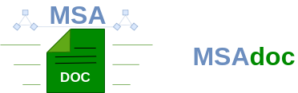

**Document your microservice architecture - recentralize decentralized documentation!**

_Note_: This project is currently in developent, this document describes the vision of the tool. If you like the project we'd appreciate a star!

## Mission

Microservice-based projects often struggle with documentation. Information is distributed to various places, especially if there is a lack of standard procedures to document the microservices and the architecture. `msadoc` is a tool that allows documenting metadata of each microservice directly in its code base increasing the odds of keeping the documentation consistent. The metadata is collected in a central place serving as an entry point to documentation, increasing documentation's discoverability, and automating the extraction of higher-value documentation.


<!-- TODO: 2 nice screenshots of UI. -->

## Quickstart

1. [Deploy](./docs/deployment.md) your `msadoc-server` instance on your servers.

2. Add a `service.msadoc.json` file to your microservice project. See the [docs](./docs/service-doc.msadoc.md) for more information.
Example:
```json
{
  "name": "PipelineService",
  "tags": ["pipeline"],
  "providedAPIs": ["PipelineAPI"],
  "consumedAPIs": ["DatasourceAPI"],
  "repository": "https://github.com/jvalue/ods",
  "developmentDocumentation": "https://github.com/jvalue/ods/blob/main/pipeline/README.md",
  "deploymentDocumentation": "https://github.com/jvalue/ods",
  "apiDocumentation": "https://github.com/jvalue/ods/tree/main/pipeline#api",
  "responsibleTeam": "PipelineTeam",
}
```

3. Push the `service.msadoc.json` file to the `msadoc-server` instance via your CI system.  
  3.1 Generate an [API key](./docs/api-keys.md) in the `msadoc-server`.  
  3.2 Use the [CLI](./cli/README.md) to push to the `msadoc-server`.

4. Browse all your microservices on your `msadoc-server` instance.


### Enable deployment information (Kubernetes)

5. Add a `deployment.msadoc.json` file to your deployment project for each deployment environment you use (e.g. dev, prod, staging, ...). See the [docs](./docs/deployment-doc.msadoc.md) for more information.
Example:
```json
{
  "name": "prod",
  "kubernetesUrl": "https://131.188.64.201:6443",
  "kubernetesCa": "ca-secret",
  "kubernetesUser": "my_k8s_user",
  "kubernetesUserCert": "user-cert",
  "kubernetesUserKey": "user-key",
  "kubernetesLabels": [
    "app=ods",
    "stage=prod",
  ]
}
```
7. Enhance your `service.msadoc.json` in order to match Kubernetes resources with your microservices.
```json
{
  "name": "PipelineService",
  // ...
  "kubernetesLabels": [
    "service=pipeline-service"
  ],
}
```

8. Push the `deployment.msadoc.json` file via [CLI](./cli/README.md) to the `msadoc-server` instance via your CI system.  
9. Browse all your microservices together with their deployment information on your `msadoc-server` instance.


## Docuemtation
* [Format of service.msadoc.json files](./docs/service-doc.msadoc.md)
* [Format of deployment.msadoc.json files](./docs/deployment-doc.msadoc.md)
* [Deployment](./docs/deployment.md)
* [Tutorial: Generating and using API keys](./docs/api-keys.md)


## Architecture

* The [msadoc-server](./server/README.md) collects the `*.msadoc.json` files and provides backend functionality to browse the aggregated information.
* The [msadoc-frontend](./ui/README.md) connects to the `msadoc-server` and presents the aggregated documentation to the user. 
* The [cli](./cli/README.md) allows pushing the `*.msadoc.json` file to the `msadoc-server`.


## License

Copyright 2022 Friedrich-Alexander Universität Erlangen-Nürnberg.

Licensed under the Apache License, Version 2.0 (the "License");
you may not use this file except in compliance with the License.
You may obtain a copy of the License at http://www.apache.org/licenses/LICENSE-2.0

Unless required by applicable law or agreed to in writing, software
distributed under the License is distributed on an "AS IS" BASIS,
WITHOUT WARRANTIES OR CONDITIONS OF ANY KIND, either express or implied.
See the License for the specific language governing permissions and
limitations under the License.

SPDX-License-Identifier: Apache-2.0
