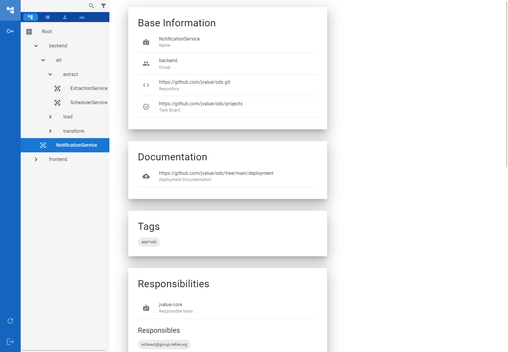
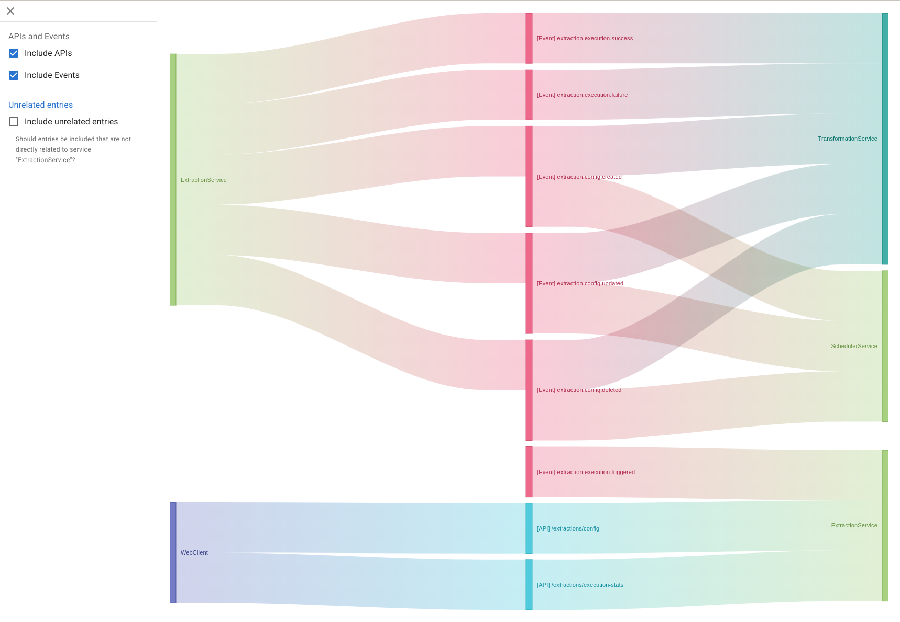
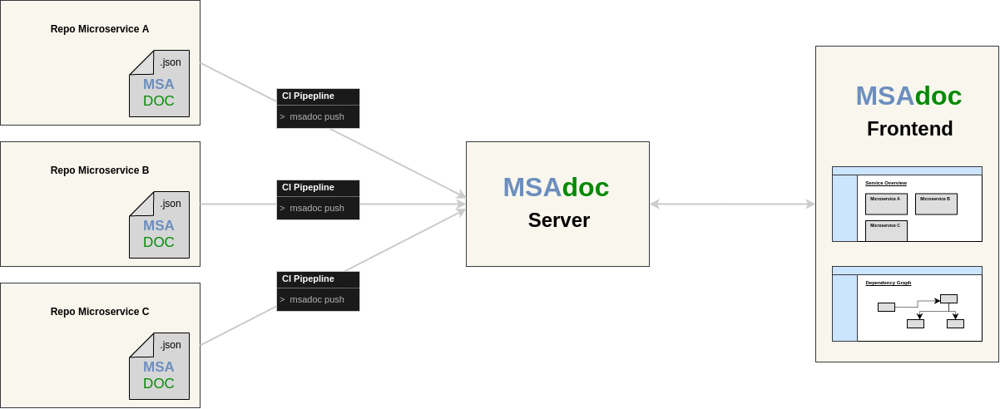

**The entrypoint to your microservice documentation.**

- **No entry barriers**: Document each microservice within its repository with a standardized JSON file. We try to keep the tool tech-stack agnostic to support as many project settings as possible.
- **Generate higher-level documentation:** Outdated architecture diagrams were yesterday. Currently, we support generating sankey charts to display service dependencies. More diagram types to come.
- **Architecture discovery:** Browse through the aggregated documentation. Use the filter function to only show services of interest.
- Arrange microservices in an hierarchical structure (groups) to keep an overview.
- Find the responsible person if you need to get in touch with the service owner.
- Extend the documentation format with custom fields according to your very specific needs.

**[A demo is available here!](https://osrgroup.github.io/msadoc)**

## Mission

**Problem:**
Microservice-based projects often struggle with documentation. Information is distributed to various places, especially if there is a lack of standard procedures to document the microservices and the architecture. At the same time, higher-level documentation that gives an overview over the system (like architecture diagrams) becomes outdated quite quickly.

**Solution:**
`msadoc` is a tool that allows documenting metadata of each microservice directly in its code base increasing the odds of keeping the documentation consistent. The metadata is collected in a central place serving as an entry point to documentation, increasing documentation's discoverability, and automating the extraction of higher-value documentation like architecture diagrams.

## Usage

1. [Deploy](./docs/deployment.md) your `msadoc-server` instance on your servers.

2. Add a `msadoc.json` file to your microservices. See the [docs](./docs/msadoc.md) for more information.
   Example:

```json
{
  "name": "PipelineService",
  "group": "ods.pipeline",
  "tags": ["pipeline"],
  "providedAPIs": ["PipelineAPI"],
  "consumedAPIs": ["DatasourceAPI"],
  "repository": "https://github.com/jvalue/ods",
  "developmentDocumentation": "https://github.com/jvalue/ods/blob/main/pipeline/README.md",
  "deploymentDocumentation": "https://github.com/jvalue/ods",
  "apiDocumentation": "https://github.com/jvalue/ods/tree/main/pipeline#api",
  "responsibleTeam": "PipelineTeam"
}
```

3. Push the `msadoc.json` file to the `msadoc-server` instance via your CI system.  
   3.1 Generate an [API key](./docs/api-keys.md) in the `msadoc-server`.  
   3.2 Use the [CLI](./cli/README.md) to push to the `msadoc-server`.

4. Browse all your microservices on your `msadoc-frontend` instance.
<p float="left">
  
   
</p>

## Documentation

- [Format of msadoc.json files](./docs/msadoc.md)
- [Deployment](./docs/deployment.md)
- [Tutorial: Generating and using API keys](./docs/api-keys.md)
- [Tutorial: Use example data for a demo](./example/README.md)

## Architecture

- The [msadoc-server](./server/README.md) collects the `msadoc.json` files and provides backend functionality to browse the aggregated information.
- The [msadoc-frontend](./ui/README.md) connects to the `msadoc-server` and presents the aggregated documentation to the user.
- The [cli](./cli/README.md) allows pushing the `msadoc.json` file to the `msadoc-server`.



## Development Setup

### First steps

To get started, we need to perform the following steps:

1. Install all dependencies
2. Start the backend
3. Start the frontend

#### 1. Install all dependencies

To install all dependencies, simply run:

```bash
$ npm install
```

> Whenever you checkout a new version of msadoc, make sure to run this command so that your dependencies are up-to-date.

> Tip for developers: Among others, this command will also build a shared npm library called `msadoc-client`. This library is used in the frontend. When building this library, the old library output is always deleted first. This might lead to some "hiccups" in your IDE (i.e. your IDE might insist that the library does not exist, even after the build has finished). If you experience this problem, simply restart your IDE after building the client library. If you are using VSCode, you can alternatively use the "Restart TS server" and "Restart ESLint Server" commands. In some cases, the frontend dev server might also run into a similar "hiccup". If this is the case, restart the dev server. If this does not help, delete `frontend/node_modules/.cache/`.

#### 2. Start the backend

First, we need to start our Postgres development database using Docker:

```bash
$ docker compose -f ./deployment/dev/docker-compose.yaml up
```

Then, we need to provide a `.env` file for our backend:

```bash
$ cp ./server/.env.dev.local ./server/.env
```

Finally, we can start the server:

```bash
$ npm run start -w=server
```

> For more options and further explanations, see the [Server README](./server/README.md).

#### 3. Start the frontend

Simply run the following command to start the frontend:

```bash
$ npm run start -w=frontend
```

Open [http://localhost:3001](http://localhost:3001) to view the frontend in your browser.

> For more options and further explanations, see the [Frontend README](./frontend/README.md).

### VSCode settings

We provide a `settings.json` for **VSCode** that you can use for a seamless development workflow with Prettier and ESLint.
To use it just `cp .vscode/settings-recommended.json .vscode/settings.json`

## License

Copyright 2022 Friedrich-Alexander Universität Erlangen-Nürnberg.

Licensed under the Apache License, Version 2.0 (the "License");
you may not use this file except in compliance with the License.
You may obtain a copy of the License at http://www.apache.org/licenses/LICENSE-2.0

Unless required by applicable law or agreed to in writing, software
distributed under the License is distributed on an "AS IS" BASIS,
WITHOUT WARRANTIES OR CONDITIONS OF ANY KIND, either express or implied.
See the License for the specific language governing permissions and
limitations under the License.

SPDX-License-Identifier: Apache-2.0
