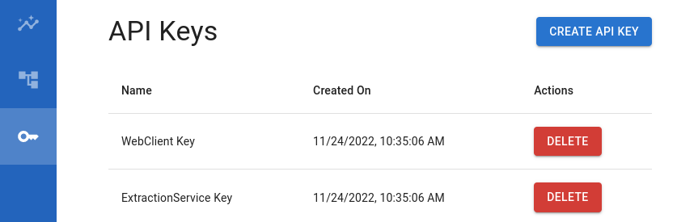
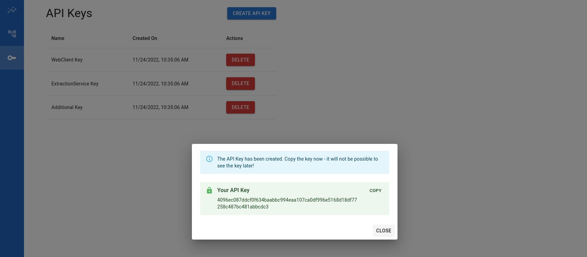
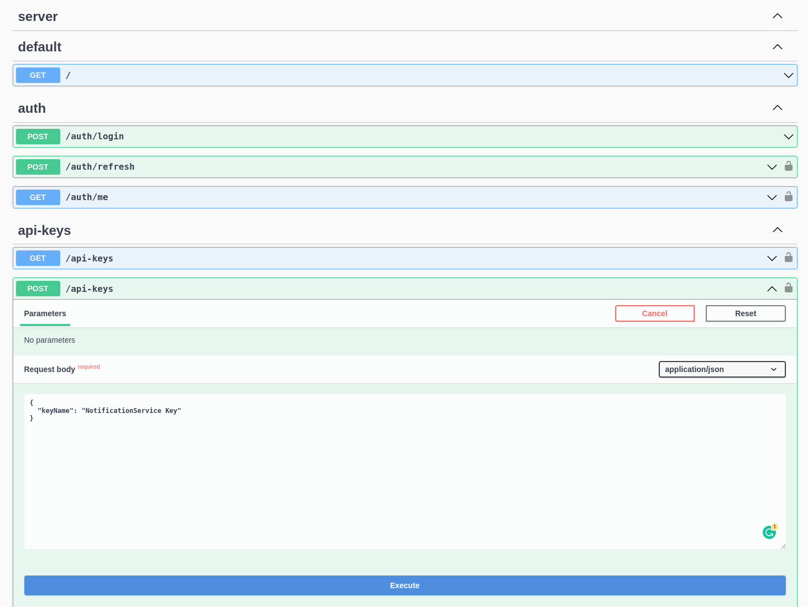

# API Keys

**API keys** are used as an alternative authentication method to speak with parts of the server API.
We recommend using them in your **CI pipelines**.

## Managing API Keys

### via Frontend

- Find the API key management page in the left main menu.
  
- Use the `CREATE API KEY` button to start the API-key creation process. Assign it a speaking name in case you need to invalidate it in the future. Keys are valid until invalidated manually.
- Copy the created key. After closing the dialogue, there is no way to get your hands on the key again unless you generate a new one.
  
- Use the key in your CI pipeline (e.g., by using a CI secret).

### via the API

- Use the API directly to generate API keys.
- You can use Swagger UI to do so on `{url}:{port}/api`, e.g., on `http://localhost:3000/api`
  
